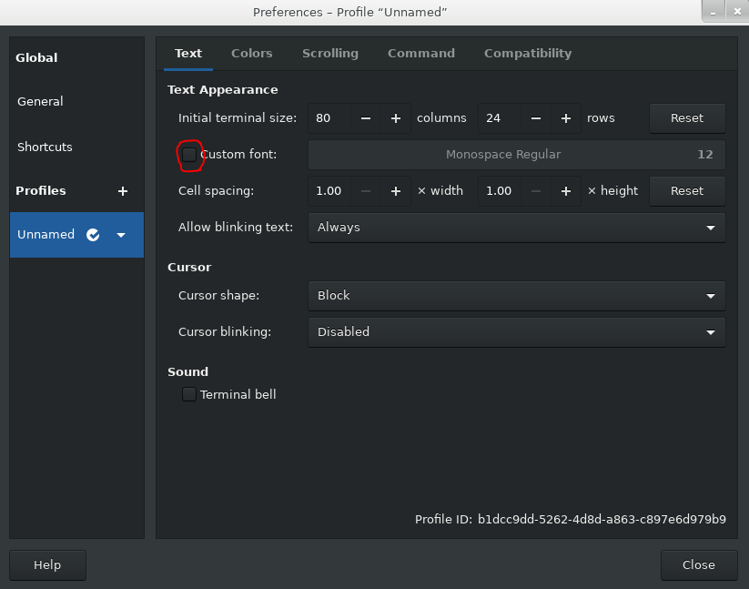
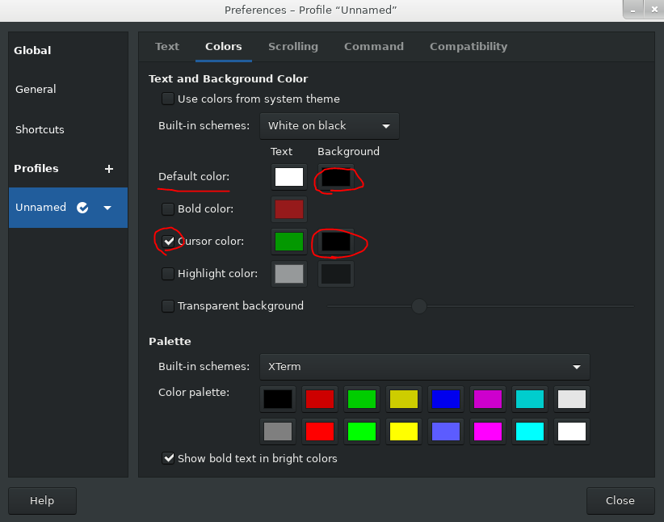

# OCR

 OCR for linux terminal

***

## Feature

contain **95** characters :  

```text
a~z                    : 26 
A~Z                    : 26
0~9                    : 10
!@#$%^&*()             : 10
`~-_=+\|]}[{'";:/?.>,< : 22
                       : 1  (space)
Total : 95
```

***

## constraint

* Monitor resolution : 1080p

* only support 1 monitor or 2 monitors

* Font style : Default  


* Background color : #000000  
Cursor color (Background color) : #000000  


* Close windows notification  


***

## Quick Start

1. Navigate to OCR/OCR/

2. Run calibration :
    ```text
    python calibration.py
    ```
    If you see **success** at the bottom of the terminal, it means the calibration is successful.

3. Now you can run inference_fast :
    ```text
    python inference_fast.py
    ```

***

## Develop notes

[notes](https://www.evernote.com/shard/s198/sh/98ed70d8-1980-3952-eaec-3e5df3879652/a3cf73b2bb63d88fe7fd340f7d877d02)
